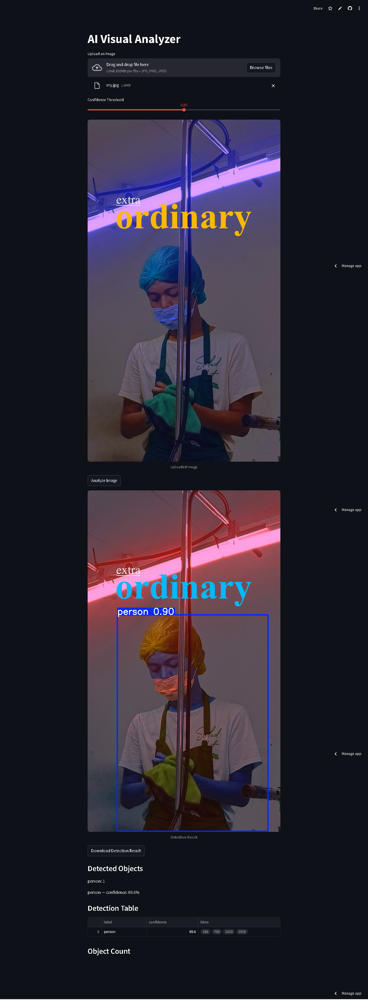

# AI Visual Analyzer

AI Visual Analyzer is a simple web application that detects objects in images using YOLOv8.

## Features

- Upload an image
- Detect objects using YOLOv8
- Display bounding boxes
- Show detection confidence
- Download analyzed image

## Tech Stack

- Python
- Streamlit
- Ultralytics YOLOv8
- OpenCV
- NumPy
- Pillow

## Live Demo

Try the application here:

https://ai-visual-analyzer.streamlit.app/

## Demo



## Installation

```bash
git clone https://github.com/einzeinn/ai-visual-analyzer.git
cd ai-visual-analyzer
pip install -r requirements.txt
streamlit run app.py
